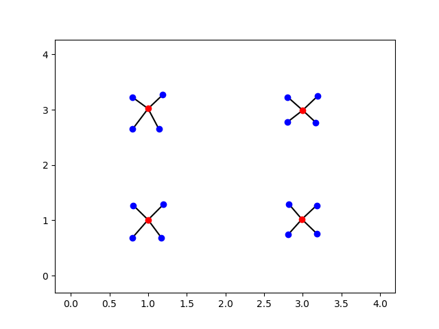
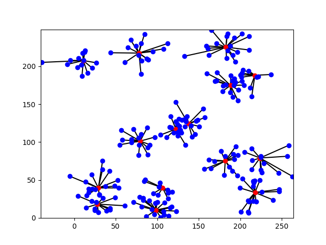

# Major project for CS 4623-01

## Introduction

Taught by [Dr. Roger Wainwright](https://engineering.utulsa.edu/computer-science/faculty/profile/roger-wainwright/) in SP 2023.

Experiments with the following techniques to solve the P-Median problem.
  - A simple genetic algorithm
    - Roulette, Rank, and Tournament selection
    - Single-Point, Double-Point, and Uniform crossover
    - Simple and Hyperheuristic mutation
    
  - A simulated annealing algorithm.
    - Simple and Hyperheuristic perbutation.
    
  - A foolish hill climbing algorithm.
    - Similiar implementation to simulated annealing, except 'worse' chromosomes are not considered at all.

## Sample solutions(generated through genetic algorithm)
  - Fun fact:
    - For the largest dataset in this repo, there are C(240, 15) =  247,012,484,980,695,576,597,296 possible combinations!!!
    - This is easily in the range of an NP-Hard problem

  - Algorithm constants:
    - 100 epochs
    - Population size of 50
    - 100% crossover rate
    - 5% mutation rate
  - Small dataset
    - P=4 with 20 points. 
    - Solution generated with roulette selection, single point crossover, and simple mutation.
      
      
  - Largest dataset
    - P=15 with 240 points.
    - Solution generated with rank selection, uniform crossover, and hyper heuristic mutations
      
